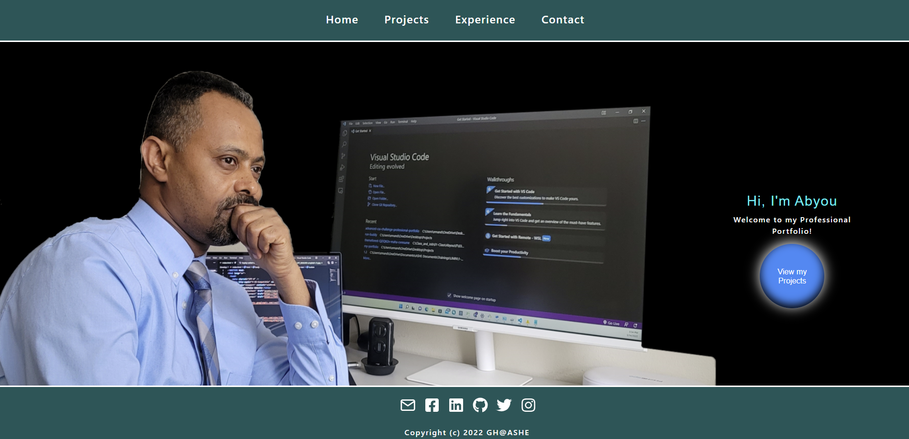
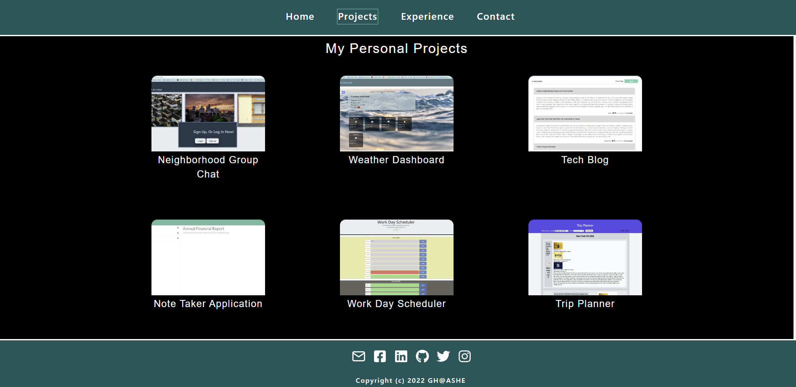
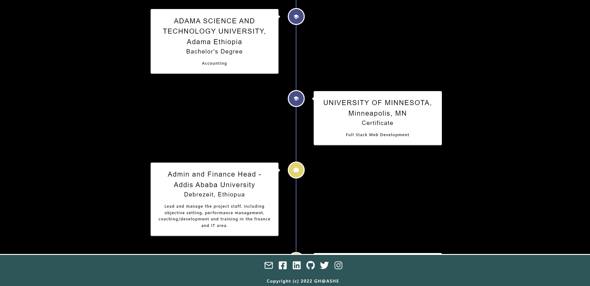

# React Portfolio Website🔥

## Table of Content

- [Description](#description)
- [Website Preview](#website-preview)
- [Installation and Deployment](#installation-and-deployment)
- [Features](#features)
- [Sections](#sections)
- [ Built With](#built-with)
- [Contributing](#contributing)
- [License](#license)
- [Questions](#questions)

## Description

This is a simple, user-friendly, and responsive multi page React portfolio site built for Abyou Geletu that shows of my projects I created, skills and talents to employers looking to fill a part-time or full-time position.

## Website Preview

### Home Page

### Projects Page

### Experience Page

### Mobile View

### Add Post

## Installation and Deployment

# 📦

## Installation

1. In order to use this application, simply git clone the repo to your local so that you have the React project there on your local machine.

2. Use npm install to install the npm package dependencies listed in your package.json.

3. In the project directory, run npm start.

4. To use the app locally, using the command line, you should run npm start to start the application, and then open https://localhost:3000/ in any web browser to launch the app. If you make any edits, the page will reload.

The app is also live at the following link:

- [Live on Github](https://ghashe.github.io/react-portfolio/)

You can clone the most recent version of repo into your machine

- [Github](https://github.com/ghashe/react-portfolio)

## Features

# 📋

📖 Multi-Page Layout

🎨 Styled with React-Bootstrap and Css with easy to customize colors

📱 Fully Responsive

## Sections

# 📚

✔️ Header  
✔️ Home Page  
✔️ Projects Page  
✔️ Experience Page  
✔️ Contact Page  
✔️ Footer

## Built With

# 🛠️

This project was built using these technologies.  
✔️ HTM  
✔️ CSS  
✔️ JavaScript ES6  
✔️ Node.js  
✔️ React  
✔️ Github ( for version controll and hosting platform)

## Contributing

# 💡

It would be great if you could contribute in any way

- 👯 Git clone the repo to your local machine
- 🔨🔨🔨 Develop your code
- 🔃 Create a new pull request.

## License

- [MIT](https://github.com/ghashe/License) license has been applied to this project

## Questions

    If you have any questions, feel free to contact me via the following contact information:

- Emain: emandaabyou@gmail.com
- GitHub account: [ghashe](https://github.com/ghashe)
- Linkedin: https://www.linkedin.com/in/abyou-geletu-5ba16622b

---

_This README has been generated by ❤ [Professional-README-generator](https://github.com/ghashe/professional-README-generator) © 2022_

---
